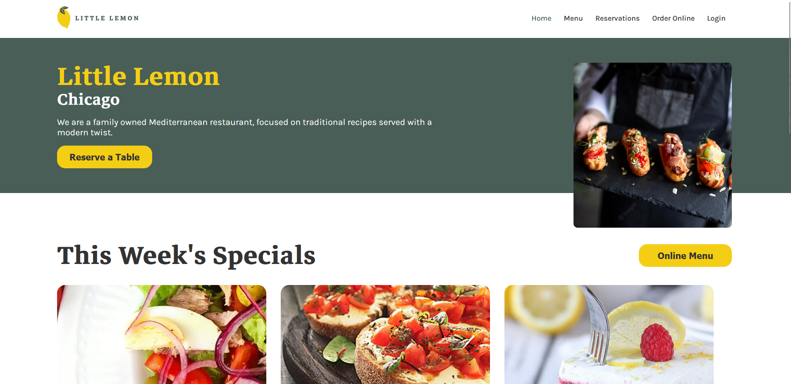
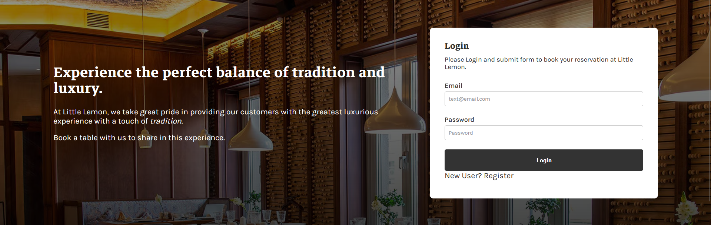
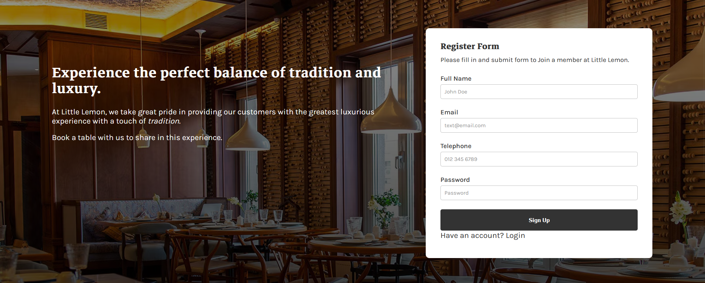
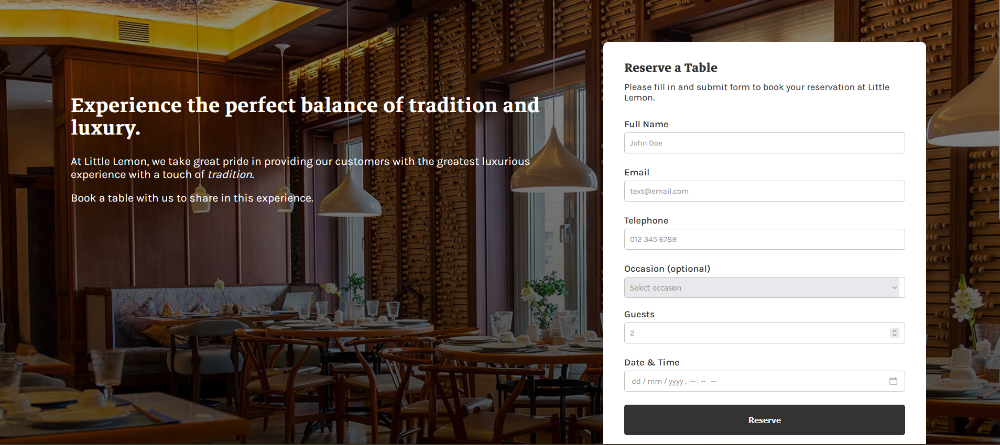

# Project Description

Little Lemon Restaurant Table Serve is a table reservation system designed for restaurants, enabling users to quickly book tables through a user-friendly web interface.

This project utilizes ReactJS for the front-end, Python (Flask) for the back-end, and MySQL as the database to store reservation data.

## Features

User Features:

    Browse and select available tables based on desired time slots.
    Submit and confirm reservations.

## Technology Stack

    Frontend: ReactJS
    Backend: Python (Flask)
    Database: MySQL
    Other Tools:
        Axios (API communication)
        React Hook Form (form management)

### `npm start`

Runs the app in the development mode.\
Open [http://localhost:3000](http://localhost:3000) to view it in your browser.

The page will reload when you make changes.\
You may also see any lint errors in the console.

## `Run Backend Server`
    flask run

## Screen Shot Interface

Home Page

Login Page

Register Form Page

Rerserve Table form

